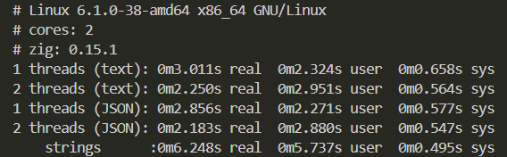

# stringer

A fast, cross-platform string extractor written in Zig. Scans memory-mapped files for ASCII/UTF-8 (ASCII subset) and UTF-16 (LE/BE) strings with multi-threaded chunking and deterministic output.

--- 

## Why string extraction matters in RE

Strings are the lowest-effort, highest-signal artifact that can be pulled from a binary. A fast strings pass often tells us what the program does before we ever open a disassembler.

### What strings reveal

- Intent clues: error messages, feature names, log prefixes, usage/help text.
- IO targets: file paths, registry keys, service names, IPC channels, sockets/ports.
- Network intel: domains, URLs, API endpoints, user-agents.
- Crypto & packers: algorithm names (AES, RC4), library banners, packer tags.
- Locale & UX: supported languages, UI labels → hints at target platforms/users.
- Config & toggles: env var names, flags (--debug, --safe-mode, -k).

### Why it speeds up analysis

- Triage: decides if a sample is worth deeper work (malware family, tool category).
- Scoping: identifies subsystems to focus on.
- X-refs: takes a distinctive string, then cross-reference it in the disassembler to jump straight to relevant functions.
- De-obfuscation baseline: after unpacking or dumping process memory, compares string sets to confirm actually revealed new code/paths.

---

## Features (MVP)

ASCII/“UTF-8-lite” (printable bytes) detector

UTF-16LE (optional UTF-16BE) detector

Per-hit offset, type, and length

--min-len threshold (default 5)

Multi-threaded chunk scan with boundary overlap

---

## Text or JSON output

POSIX & Windows file mapping; - reads from stdin (no mmap)

---

## Install / Build
```
# Zig 0.15.x+ recommended
zig build -Drelease-fast
# binary at: zig-out/bin/stringer
```

## Quick start
```
# Basic ASCII + UTF-16LE scan
./stringer a.out

# JSON output for pipelines
./stringer --json a.out | jq

# Adjust minimum length
./stringer --min-len 8 a.out

# Choose encodings (comma-separated)
./stringer --enc ascii,utf16le a.out

# Use all cores
./stringer --threads auto a.out
```

## Example output

Text:

```
0000000000002004  ascii    len=12  "Invalid key"
0000000000002012  utf16le  len=10  "Hello, UI"
```

JSON:

```
{
"header":{
"tool":"stringer",
"time":"+2025-+10-+18T+1:+24:+32.+707Z",
"file":"a.out"
}
"body":[
{"offset":8196,"kind":"ascii","len":12,"text":"Invalid key"}
{"offset":8210,"kind":"utf16le","len":10,"text":"Hello, UI"}
]
}
```

Text mode offsets are hex; JSON uses decimal  

CLI
```
stringer [options] <file|->

Options:
  --min-len N, -m N     Minimum characters per hit (default {d})
  --enc LIST, -e LIST   ascii,utf16le,utf16be,all  (default: …)
  --threads N|auto, -t  Worker threads (default: …; auto=#cpus)
  --json, -j            Emit JSON lines
  --null-only, -n       Require \0 / 0x0000 terminator before emit
  --cap-run-bytes N, -c Truncate very long runs (default {d})
  --version, -v         Print version and exit
  --help, -h            Show help
```

---

## How it works (short)

Two detectors:

ASCII: runs of 0x20..0x7E (+ \t \n \r if enabled).

UTF-16LE/BE: pairs with a zero high/low byte and printable ASCII in the other byte.

Chunking: file is split into N slices with overlap so strings crossing boundaries aren’t missed.

Overlap = minlen-1 bytes for ASCII, 2*(minlen-1) for UTF-16.

Offsets: hits report absolute file byte offsets.

## Limitations (MVP)

UTF-8 validation is off by default (ASCII subset only).

No section-aware fast mode (ELF/PE) yet.

Packed/obfuscated strings require dynamic memory dumps (out of scope for MVP).  

## Roadmap (post-MVP)  

- **TUI (`stringer-tui`)**: one-screen, two-pane view (matches + hex/ASCII), live `/search`, encoding/min-len toggles, export from the visible set. ANSI-only; auto-fallback to CLI when not on a TTY.  
- **Exports**: `--format csv|jsonl|yara|sigma`  
  - **CSV**: `offset_hex,offset_dec,length,enc,preview`  
  - **JSONL** (stable API): `{"offset":..., "length":..., "enc":"...", "preview":"..."}`  
  - **YARA seeds**: scaffold rules from selected strings.  
  - **Sigma seeds** (experimental): hunting templates for log search.  
- **CLI additions**: `--regex <expr>`, `--entropy >x.y`, `--range <start:end>`, `--limit/--skip`, `--no-color`.  
- **Stability**: core extraction remains stable; JSONL treated as a versioned contract (additive fields only).  
- **Performace**: Implementation of SIMD ASCII scanning and buffered output to push CPU utilization  

--- 

## Performance

### Testing environment  

- **Host:** 2 vCPUs (KVM VM) - Debian 12  
- **Input:** 100 MB file in RAM
- **Cmds:** ASCII only, `--min-len 15`, output redirected to `/dev/null`



## License

MIT (see LICENSE).  

---

## Credits

Built for fast, secure reverse-engineering workflows (and to spread the Zig language)   
Author: @skywolf-re  
Contributions welcome!
